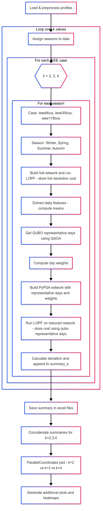

# Quantum-Inspired Temporal Aggregation for Power System Capacity Expansion

## Context

Modern power system planning require high-resolution temporal data to accurately capture the variability of renewable resources and load. However, full resolution hourly data are computationally expensive.  In this study, we explore the integration of Quantum Approximate Optimization Algorithm (QAOA)-based clustering into power system capacity expansion planning (CEP). Our methodology focuses on non-uniformly weighted representative day selection using Quadratic Unconstrained Binary Optimization (QUBO) formulations for significantly reducing temporal data without losing modeling accuracy. We simulate multiple scenarios across different seasonal demand types, various IEEE test networks from simple to complicated, and diverse generator placements, including dispatchable (hydro) and non-dispatchable (wind) units. To evaluate the robustness of the model, sensitivity analysis is carried out by varying the number of representative days. The results are compared with full-scale simulations to evaluate deviation of the cost. The results demonstrate the high accuracy (4-6% deviation in cost in comparison with full resolution) and significant reduction in the size of the optimization problem by using QUBO-based clustering.  This work contributes to scalable, precise, and effective energy planning by bridging the gap between quantum optimization and practical power systems.

## Features

Our methodology has two main components: 
1. A representative day selection algorithm based on formulating problem as a Quadratic Unconstrained Binary Optimization (QUBO) problem and solves it with the Quantum Approximate Optimization Algorithm (QAOA) 
2. A capacity expansion planning model based on linear optimal power flow (LOPF) in [PyPSA](https://pypsa.readthedocs.io/en/latest/). The selected representative days, each weighted appropriately to represent multiple actual days, are used to compute system investment and operational costs.

## Experiments & Evaluation
We evaluated the QUBO‑based temporal aggregation (via QAOA) across three scenarios:
- **Experiment 1 ([experiment_1.py](experiment_1.py)):** k = 2 and number of representative days per season is 12 
- **Experiment 2 ([experiment_2.py](experiment_2.py)):** k = 3 and number of representative days per season is 18 
- **Experiment 3 ([experiment_3.py](experiment_1.py)):** k = 4 and number of representative days per season is 24 

All scenarios cover four seasons (Winter, Spring, Summer, Autumn) and three network topologies ([IEE9‑bus](https://github.com/MATPOWER/matpower/blob/master/data/case9.m), [IEEE30‑bus](https://github.com/MATPOWER/matpower/blob/master/data/case_ieee30.m), [IEEE118‑bus](https://github.com/MATPOWER/matpower/blob/master/data/case118.m)). We compare full‑resolution versus aggregated results for cost deviations (4–6% under deterministic placement) and dispatch accuracy, highlighting variability introduced by random placement

## Flow Chart

## Reference Data

**Load & Wind Profiles:** Sourced from the [Open Source Power Data platform](https://data.open-power-system-data.org/time_series).

**Hydro Profile:** Synthetic generation based on seasonality and capacity parameters. 

The dataset we work with spans from December 2018 through November 2019, was divided into four seasons to capture distinct demand patterns. We handle each season independently, under the assumption that system conditions in different seasons are sufficiently distinct that representative days should be picked separately for each season. We further divide each season into months and half-months during quantum clustering using QAOA so that the number of parameters would be approximately 215 − 216
 which our simulator can handle. 

## Installation

### Prerequisites
- python 3.10 and above
- pip

### Usage
- Clone the repository
- Create Virtual Environment (python -m venv venv)
- Activate Virtual Environment (venv\Scripts\activate)
- Install dependencies (`pip install -r requirements.txt`)
- `python experiment_1.py`
